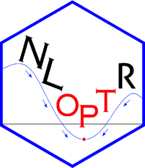

<!-- README.md is generated from README.Rmd. Please edit that file -->

```{r, include = FALSE}
knitr::opts_chunk$set(
  collapse = TRUE,
  comment = "#>",
  fig.path = "man/figures/README-",
  out.width = "100%"
)
```

# [**nloptr**](https://astamm.github.io/nloptr/) 

<!-- badges: start -->
[](https://github.com/astamm/nloptr/actions/workflows/R-CMD-check.yaml)
[](https://app.codecov.io/gh/astamm/nloptr)
[](https://github.com/astamm/nloptr/actions)
[](https://CRAN.R-project.org/package=nloptr)
<!-- badges: end -->

[**nloptr**](https://astamm.github.io/nloptr/) is an R interface to [NLopt](https://nlopt.readthedocs.io/en/latest/), a free/open-source library for nonlinear optimization started by Steven G. Johnson, providing a common interface for a number of different free optimization routines available online as well as original implementations of various other algorithms. It can be used to solve general nonlinear programming problems with nonlinear constraints and lower and upper bounds for the controls, such as

$$ \min_{x \in \mathbb{R}^n} \quad f(x), $$

s.t. $g(x) \le 0$, $h(x) = 0$ and $\ell \le x \le u$.

The [NLopt](https://nlopt.readthedocs.io/en/latest/) library is available under the GNU Lesser General Public License (LGPL), and the copyrights are owned by a variety of authors. See the [website](https://nlopt.readthedocs.io/en/latest/Citing_NLopt/) for information on how to cite NLopt and the algorithms you use.

## Installation

### Windows

On Windows, for old versions of R (`R <= 4.1.x`), the *nlopt* `v2.7.1` from [rwinlib](https://github.com/rwinlib/nlopt) is used. For newer versions of R (`R >= 4.2.0`), the *nlopt* version from the corresponding `RTools` toolchain is used.

### Linux and macOS

On Unix-like platforms, we use `pkg-config` to find a suitable system build of [NLopt](https://nlopt.readthedocs.io/en/latest/) (i.e. with version `>= 2.7.0`).

- If it is found it is used.
- Otherwise, [NLopt](https://nlopt.readthedocs.io/en/latest/) 2.7.1 is built from included sources using [CMake](https://cmake.org). In this case, a binary  of [CMake](https://cmake.org) stored in environment variable `CMAKE_BIN` is searched on the `PATH` and, alternatively, on a macOS-specific location. If that variable cannot be set, install will abort suggesting ways of installing [CMake](https://cmake.org). The minimal version requirement on `cmake` is `>= 3.2.0`.

### Installing [CMake](https://cmake.org) (macOS and Linux only)

Minimal version requirement for `cmake` is `3.2.0`.

You can install [CMake](https://cmake.org) by following [CMake installation instructions](https://cmake.org/resources/). The important thing is that you add the [CMake](https://cmake.org) binary to your `PATH`:

- On macOS, you can install [CMake](https://cmake.org) and then run it. In the menu bar, there is an item *How to Install For Command Line Use* which you can click on to have proper instructions on how to update your `PATH`. Note that the location of the [CMake](https://cmake.org) binary is always `/Applications/CMake.app/Contents/bin/cmake`. Hence, [**nloptr**](https://astamm.github.io/nloptr/) knows where to find it even if you do not update your `PATH`.
- On Linux, it will be automatically added unless you specifically change the default installation directory before building [CMake](https://cmake.org).

Alternatively, you can set an environment variable `CMAKE_BIN` pointing to a [CMake](https://cmake.org) binary of your liking on your computer for [**nloptr**](https://astamm.github.io/nloptr/) to use.

### Installing [**nloptr**](https://astamm.github.io/nloptr/)

You can install [**nloptr**](https://astamm.github.io/nloptr/) from CRAN using:

```r
install.packages("nloptr")
```

Alternatively, you can install the development version from GitHub:

```r
# install.packages("remotes")
remotes::install_github("astamm/nloptr")
```

## Acknowledgments

I would like to express my sincere gratitude to [Avraham Adler](https://github.com/aadler), [Dirk Eddelbuettel](https://github.com/eddelbuettel), [Mikael Jagan](https://github.com/jaganmn), [Tomas Kalibera](https://github.com/kalibera), [Jeroen Ooms](https://github.com/jeroen) and [Jelmer Ypma](https://github.com/jyypma) for their contributions and the very instructive discussions about the pros and cons of various build strategies in R packages.

## Reference

Steven G. Johnson, The NLopt nonlinear-optimization package, [https://nlopt.readthedocs.io/en/latest/](https://nlopt.readthedocs.io/en/latest/)
